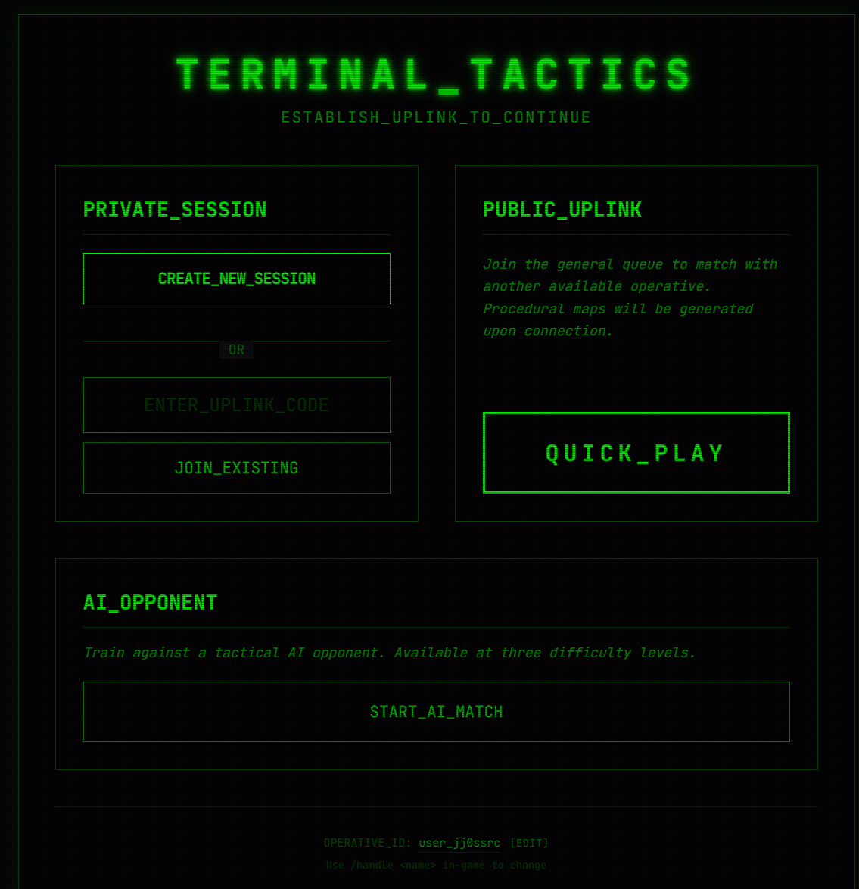
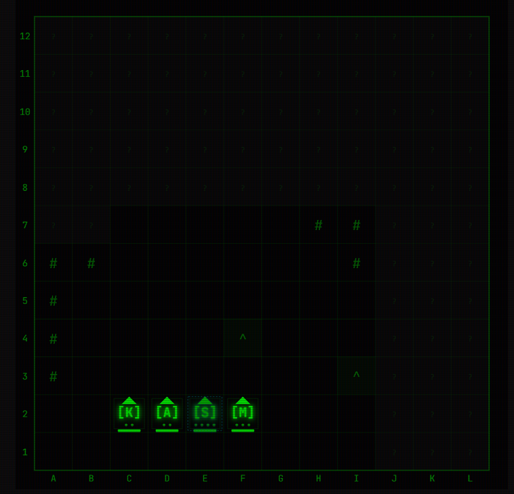
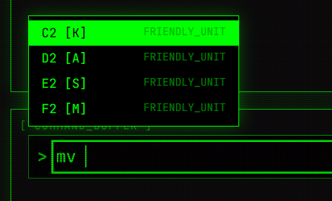

# TERMINAL_TACTICS

> `SYSTEM: ACTIVE // The Matrix is everywhere.`

**TERMINAL TACTICS** is a minimalist, high-fidelity tactical strategy game played entirely through a Command Line Interface (CLI). Built with **Vite**, **React**, **Convex**, and **Tailwind CSS**, it combines the depth of deterministic tactical combat with the aesthetic of a retro-futuristic terminal.

[](https://mansyar.itch.io/terminal-tactics)


## ⚡ Tech Stack

- **Runtime / Package Manager**: [Bun](https://bun.sh)
- **Framework**: [Vite](https://vitejs.dev) + [React 19](https://react.dev)
- **Routing**: [TanStack Router](https://tanstack.com/router)
- **Backend & Database**: [Convex](https://convex.dev)
- **Styling**: [Tailwind CSS v4](https://tailwindcss.com) (Matrix Theme)
- **Animation**: [Framer Motion](https://www.framer.com/motion/)
- **Testing**: [Bun Test](https://bun.sh/docs/cli/test) + [Testing Library](https://testing-library.com/)
- **Font**: [JetBrains Mono](https://www.jetbrains.com/lp/mono/)

## 🚀 GETTING_STARTED

### Prerequisites

- [Bun](https://bun.sh) installed globally.
- A [Convex](https://convex.dev) account.

### Installation

1.  **Clone the repository:**

    ```bash
    git clone https://github.com/yourusername/terminal-tactics.git
    cd terminal-tactics
    ```

2.  **Install dependencies:**

    ```bash
    bun install
    ```

3.  **Initialize Convex:**

    ```bash
    bunx convex dev
    ```

    This will set up your backend and generate the necessary environment variables in `.env.local`.

4.  **Run the development server:**

    ```bash
    bun run dev
    ```

5.  **Open the game:**
    Navigate to `http://localhost:3000` to enter the simulation.

## 🎮 GAMEPLAY_&_COMMANDS

The game is controlled entirely via text commands in a terminal interface. Every action is typed — no drag-and-drop, no click-to-move.

### Core Commands

| Command                    | Description                                    |
| -------------------------- | ---------------------------------------------- |
| `mv [from] [to]`           | Move a unit (e.g., `mv C2 C5`)                 |
| `atk [from] [to]`          | Attack an enemy unit (e.g., `atk C4 E4`)       |
| `heal [from] [to]`         | Heal an adjacent ally _(Medic only)_           |
| `scan [coord]`             | Reveal a 3×3 area (Scouts are invisible)       |
| `ovw [coord] [dir]`        | Set overwatch in a direction (N/E/S/W)         |
| `inspect [coord]`          | View detailed stats of a unit                  |
| `end`                      | End your turn                                  |
| `build [coord]`            | Build a wall _(Engineer only)_                 |
| `demolish [coord]`         | Destroy an adjacent wall _(Engineer only)_     |
| `rally [coord]`            | Grant +1 AP to adjacent ally _(Commander only)_|
| `map`                      | Display current map as ASCII grid              |
| `sudo mv [from] [to]`      | Ultimate: move ignoring all obstacles (1 RAP)  |
| `sudo scan`                | Ultimate: reveal entire map (1 RAP)            |
| `sudo atk [from] [to]`     | Ultimate: attack ignoring LoS, 200% dmg (1 RAP)|
| `forfeit`                  | Surrender the game                             |
| `offer draw`               | Propose a draw to your opponent                |
| `accept draw`              | Accept opponent's draw offer                   |
| `say [message]`            | Send a chat message to opponent                |
| `handle [name]`            | Set your display name (2-20 chars)             |
| `history`                  | View your last 20 matches                      |
| `help`                     | List all available commands                    |
| `clear`                    | Clear the console history                      |

📖 **Full specifications:** [docs/COMMANDS.md](./docs/COMMANDS.md)

## 📸 SCREENSHOTS

| LOBBY | GRID | CLI |
|-------|------|-----|
|  |  |  |

## 📂 PROJECT_STRUCTURE

```
terminal-tactics/
├── convex/                  # Backend functions & schema
│   ├── schema.ts            # Database schema (6 tables)
│   ├── analytics.ts         # Event logging (PAGE_LOAD, GAME_START, GAME_COMPLETE)
│   ├── game.ts              # Turn management, kernel panic
│   ├── combat.ts            # Attack, heal, scan, overwatch
│   ├── movement.ts          # Unit movement logic
│   ├── ai.ts                # AI turn execution
│   ├── lobby.ts             # Matchmaking & queue
│   ├── players.ts           # Player profiles & stats
│   └── ...                  # engineer, commander, timers, chat, etc.
├── src/
│   ├── components/          # React components
│   │   ├── Terminal/        # CLIInput, ConsoleHistory
│   │   ├── Grid/            # GridBoard, UnitModel
│   │   ├── LobbyScreen      # Matchmaking lobby
│   │   └── SquadBuilder     # Unit drafting
│   ├── hooks/
│   │   ├── useGameCommands  # Central command dispatch
│   │   ├── useHeartbeat     # Connection keepalive
│   │   └── commands/        # Command handlers per feature
│   ├── lib/
│   │   ├── commandParser    # CLI parser
│   │   ├── combatSystem     # LoS, damage calc, positioning
│   │   ├── aiEngine         # AI decision engine (3 difficulties)
│   │   └── ...              # mapGenerator, achievements, audio, etc.
│   ├── App.tsx              # Main application component
│   ├── main.tsx             # Entry point (Convex + Router setup)
│   └── styles.css           # Global Matrix theme + CRT effects
├── docs/                    # Documentation
├── conductor/               # Conductor project artifacts
└── ...
```

## 🧪 TESTING

We use **Bun Test** for unit and integration testing (480+ tests).

```bash
bun test                  # Run all tests
bun test --coverage       # Run tests with coverage report (threshold: 80%)
```

To run type checks and linting:

```bash
bun run typecheck
bun run lint
bun run build             # Production build + TypeScript check
```

## 🗺️ PROGRESS

| Phase                          | Status      |
| ------------------------------ | ----------- |
| Phase 1: Foundation            | ✅ Complete |
| Phase 2: CLI & Grid            | ✅ Complete |
| Phase 3: Multiplayer           | ✅ Complete |
| Phase 4: Movement & Squad      | ✅ Complete |
| Phase 5: Combat & Fog of War   | ✅ Complete |
| Phase 6: Polish & Juice        | ✅ Complete |
| Phase 7: Visual & UX Polish    | ✅ Complete |
| Phase 8: Session Stability     | ✅ Complete |
| Phase 9: Accessibility & Perf  | ✅ Complete |
| Phase 10: Player Profiles      | ✅ Complete |
| Phase 11: Content Expansion    | ✅ Complete |
| Phase 12: AI & Achievements    | ✅ Complete |
| Phase 13: Deployment           | 🟢 Live |

See [docs/ROADMAP.md](./docs/ROADMAP.md) for detailed progress.

## 🎯 KEY_FEATURES

- **Command-Driven Gameplay** — Every action is typed as a terminal command. No mouse required.
- **Deterministic Combat** — No RNG. Damage from positioning (front/flank/rear), elevation, and abilities.
- **Retro-Hacker Aesthetic** — Full CRT terminal experience with scanlines, glow, and Matrix-green palette.
- **Real-Time Multiplayer** — Convex-powered real-time sync with typing indicators and turn timers.
- **7 Unit Classes** — Knight, Archer, Scout, Medic, Engineer, Sniper, Commander — each with unique abilities.
- **Fog of War** — Line of sight, vision ranges, and permanent terrain memory.
- **Single-Player AI** — Practice against 3 difficulty levels (Easy/Medium/Hard).
- **Achievements** — 6 unlockable badges tracked across games.
- **Sudo Ultimate Abilities** — Root Access Points power game-changing commands.
- **Kernel Panic Events** — Random environmental hazards after turn 3.

## 📄 LICENSE

MIT
